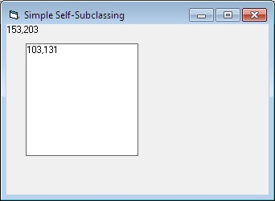



## Simple Self\-Subclassing \- Resubmitted

### Description

Simple self-sunlassed form and usercontrol -- fixed for XP... hopefully.
 
### More Info
 

             |
---                |---
**Submitted On**   |2011-03-17 18:52:50
**By**             |[Paul Caton](https://github.com/Planet-Source-Code/PSCIndex/blob/master/ByAuthor/paul-caton.md)
**Level**          |Advanced
**User Rating**    |5.0 (80 globes from 16 users)
**Compatibility**  |VB 6\.0
**Category**       |[Miscellaneous](https://github.com/Planet-Source-Code/PSCIndex/blob/master/ByCategory/miscellaneous__1-1.md)
**World**          |[Visual Basic](https://github.com/Planet-Source-Code/PSCIndex/blob/master/ByWorld/visual-basic.md)
**Archive File**   |[Simple\_Sel2199993172011\.zip](https://github.com/Planet-Source-Code/paul-caton-simple-self-subclassing-resubmitted__1-73803/archive/master.zip)

